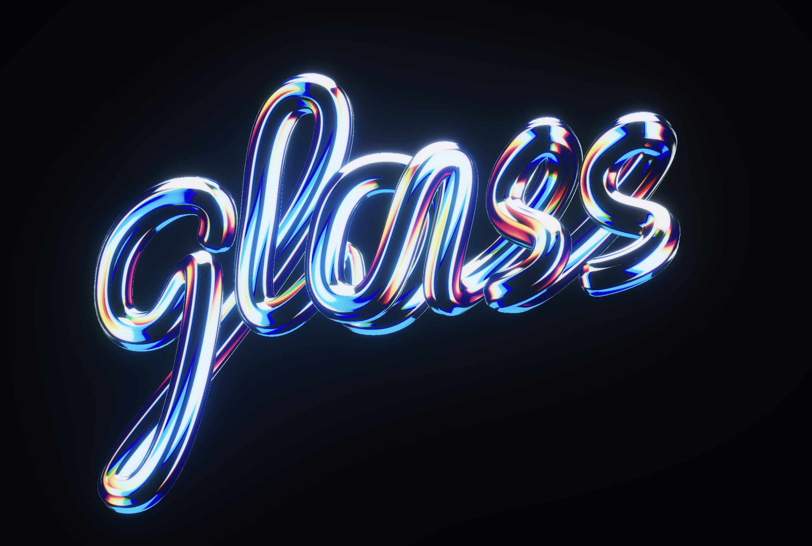
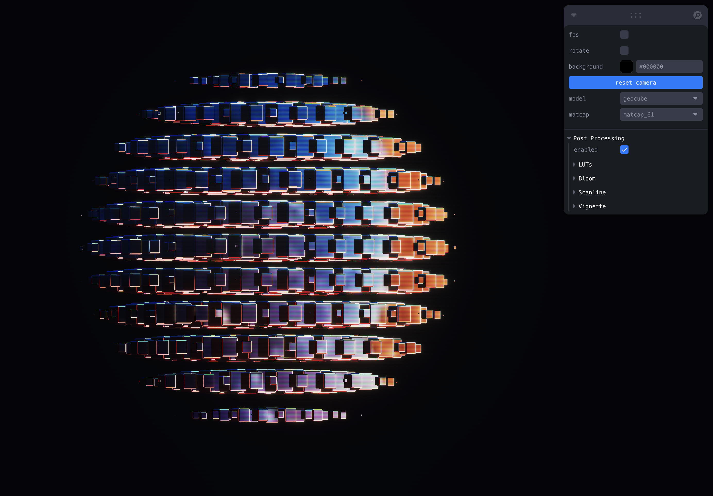
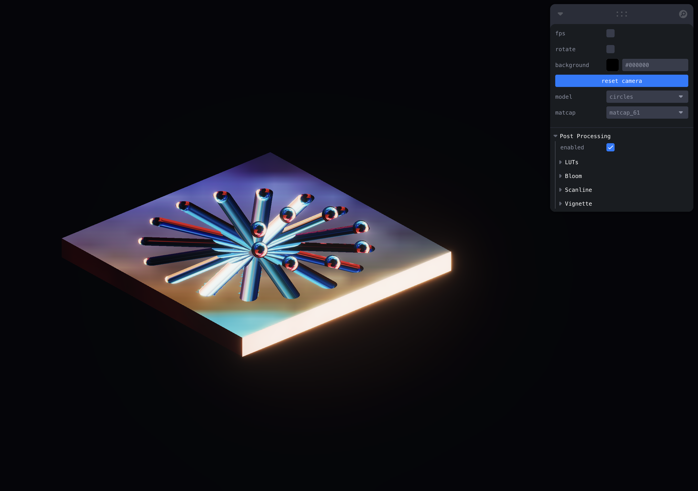
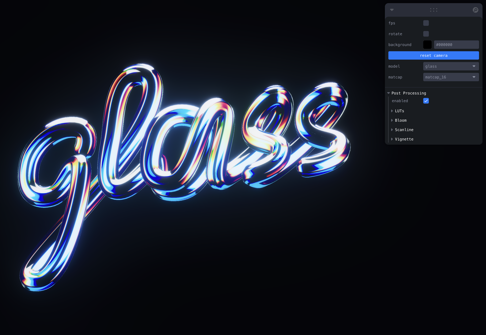

# matcaps

Explore matcaps with threejs!

# Cool Features

- Several models to choose from, including one with animation.
- Assign different matcaps to see their effects.
- Extensive postprocessing suite including LUTs, bloom scanline and vignette, try them all!
- There are **0** lights in these scenes!

# Examples

